算法笔记
======
* 打印一个序列的所有子序列
    1. 对于每一个元素做两种选择进行递归
        1. 打印
        2. 不打印
    2. 下标到最后以后,进行输出

* 奶牛问题
    1. 一开始有N只牛,牛不会死,每只牛从生下来第三年之后开始生小牛,问n年之后有多少只牛
    2. f(n) = f(n-1) + f(n-3)
    
* 获得矩阵中的最短路径和(递归改dp)
    1. 子过程就是当前位置的值加上,当前位置选择的向右走还是向下走的路径的和.
    2. 改成dp就是将重复计算的值缓存
* 判断一个整数序列中的子序列和中是否有给定的目标值
    1. 子过程就是,对于当前位置,选择加上或者不加上,返回的结果
    2. 退出条件,到最后一个数字选完

* 汉诺塔问题(N层,一开始都在from上),递归子过程如下:
	1. 将1到N-1层从from移到help上
	2. 将第N层从from移到to上
	3. 将1到N-1层从help移到to上
```
public void process(int n,String from, String to, String help){
	if(n == 1){
		sout("move" + 1 + " from " + from + " to " + to);
	}else{
		process(n-1, from, help, to);
		sout("move" + n + " from " + from + " to " + to);
		process(n-1, help, to, from);
	}
}
```


* 递归和动态规划
    1. 可以改成动态规划的递归要满足无后效性,就是子过程的结果不受之前决策的影响
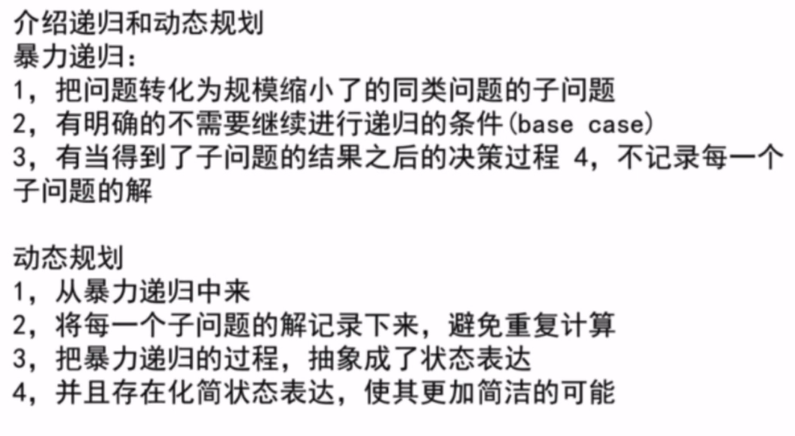

* 求最大项目收益(贪心策略)
	1. k个项目,每一个项目有花费和收益,有初始启动基金,求能做的项目做完之后的收益
	2. 将所有的项目,根据项目的花费建一个小根堆
	3. 循环k次, 
	4. 每次,从小根堆中取出花费比启动资金小的项目(如果有的话),然后按照收益大的加入大根堆
	5. 只要大根堆不为空就一直做,

* 分金条(贪心策略)
	1. 用所有的数构建一个小根堆,每次取出最小的两个加起来,返回堆,再次调整成小根堆,重复,将每次的和累加起来就是最小代价 

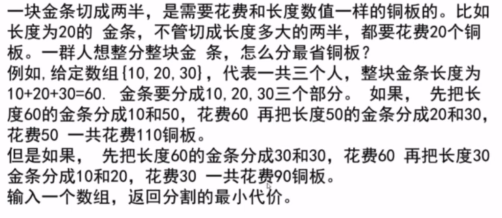

* 证明贪心策略(实际笔试或者面试的时候不用纠结,用对数器来验证)
	1. 证明比较器有传递性

* 前缀树(trieNode)
	1. 往树中插入字符串
	2. 可以查询树中有没有插入过某个字符串
	3. 可以查询插入过几次字符串
	4. 可以查询有没有以某个字符串开头的字符串,或者结尾的字符串
```
//前缀树的节点结构
public class TrieNdoe{
	public int path;	//代表这个节点被经过多少次
	public int end;		//代表多少个字符串以这个节点结尾
	public TrieNdoe[] nexts;	//代表路径

	public TrieNdoe(){
		path = 0;
		end = 0;
		nexts = new TrieNdoe[26];	//这里以26个字母为例子
	}
}

public class Trie{
	private TrieNode root;//root节点上path和end为0

	public Trie(){
		root = new TireNode();
	}

	pubilc void insert(String word){
		...
	}
}
```
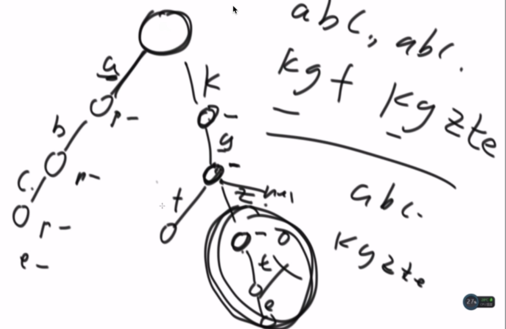

* 并查集
	1. 判断两个集合是不是同一集合(这里的集合结构是集合中的点最终指向一个点,这个点叫集合代表),就是判断集合代表是否相同
	2. 合并两个集合,就是将数量少的集合的集合代表,挂在数量多的集合的集合代表上
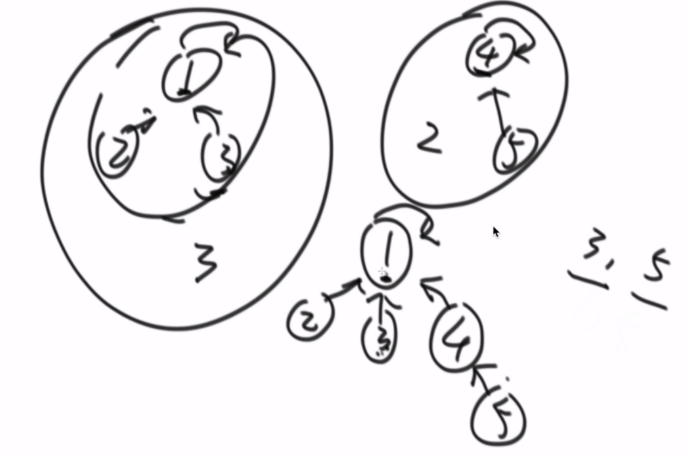
	* 可以用来**并行**解决矩阵中岛的个数的问题(用来分块计算连成一片的问题特别合适,有效避免重复计算)
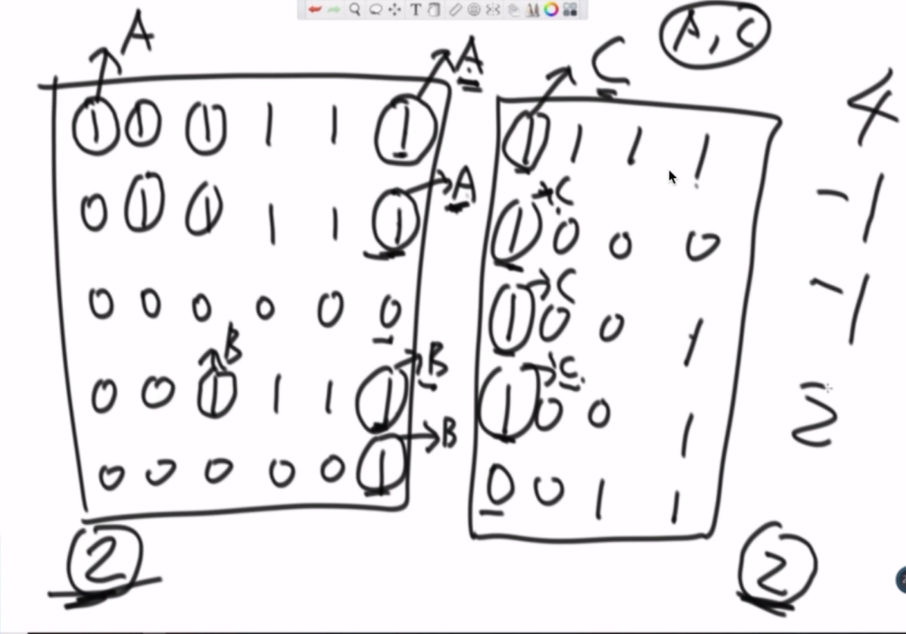

* 一致性哈希
	1. 经典服务器抗压处理
		1. 后台有m台机器,前端请求输入参数key,查询对应的value,
		2. 存(key,value)的时候计算key哈希值,然后模m,决定放在那一台后台机器上,
		3. 请求的时候用同样的hash函数计算哈希值,向对应的机器请求
		4. 缺点就是和hashMap扩容一样,增加后台的机器的时候需要重新计算所有的hash值
	2. 优化的分配结构
		1. 将hash域做成一个环,
		2. 将m台机器的IP(也可以是其他能代表机器的)经过hash之后分配到环上
		3. 存key的时候,计算key的hash值,将(key,value)存到环上第一个大于等于该hash值的机器上
		4. 扩容的时候只要将扩容机器hash值大的后一个机器上的数据迁移部分过来就行,扩容代价小
		5. 问题是分配机器的时候环上的hash域不能达到负载均衡
	3. 虚拟节点
		1. 每一台机器分配1000个虚拟节点,hash之后分配到环上,这样就基本分布均衡了 
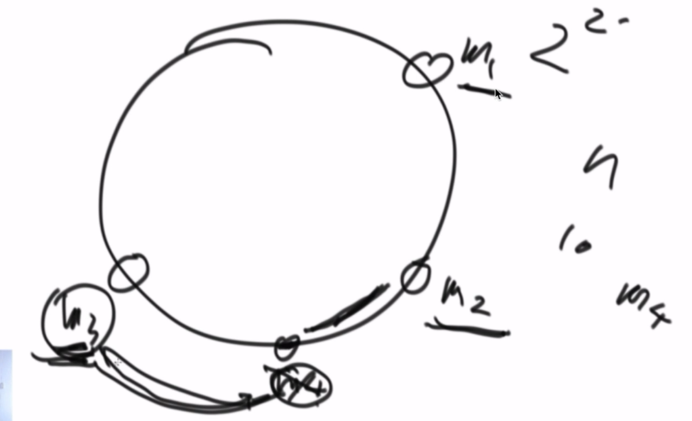

* 大文件处理,比如有一个100T的文件,存储在分布式存储系统上,文件内容就是每一行一个字符串,现在给你1000台机器,要求打印文件中重复的行
	1. 读取每一行,算出hash值,然后模1000,分配到`0~999`中的一台机器上,重复的行会在同一台机器上

* 黑名单里有100亿条url,需要判断一条url是否在黑名单里
	1. 传统解法就是多几台机器处理
	2. 使用布隆过滤器,和多个hash函数,
	3. 原来640G的空间,转化成布隆过滤器存储(失误率0.0001,样本量100亿,其中一个样本对应一个bit),只需要16G

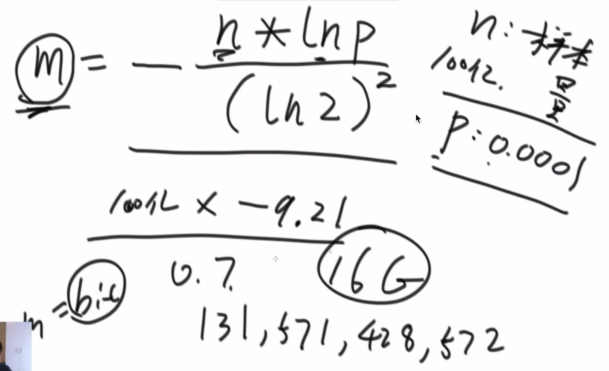
* 设计一种结构,可以不重复保存key值,并且可以随机返回key值,时间复杂度为O(1)
	1. 使用两个HashMap,一个保存`key:index`,另一个保存`index:key`,
	2. 每次取值的时候根据map的size来random出随机的index
	3. 每次删除的时候拿map中的最后一个来填补删除的位置,保证index的连续性

* 制造哈哈函数
	1. 通过一个现有的hash'函数得到hash值,然后设高八位为a,低八位为b,那么`a+b*i`为新的独立hash值,其中i为系数
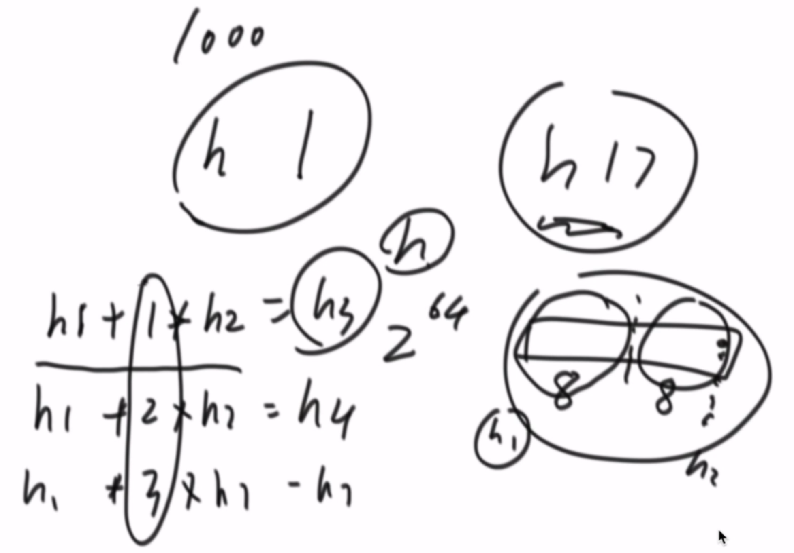

* 求一棵完全二叉树的节点个数,时间复杂度小于O(N)
	* tip:满二叉树的节点个数为2^h-1 (其中h为二叉树高度)
		1. 求二叉树左边界的高度
		1. 右子树的高度有没有到最后一层,到了左子树就是满的
		2. 没到的话右子树就是满的
		3. 递归求另外半边子树的节点个数
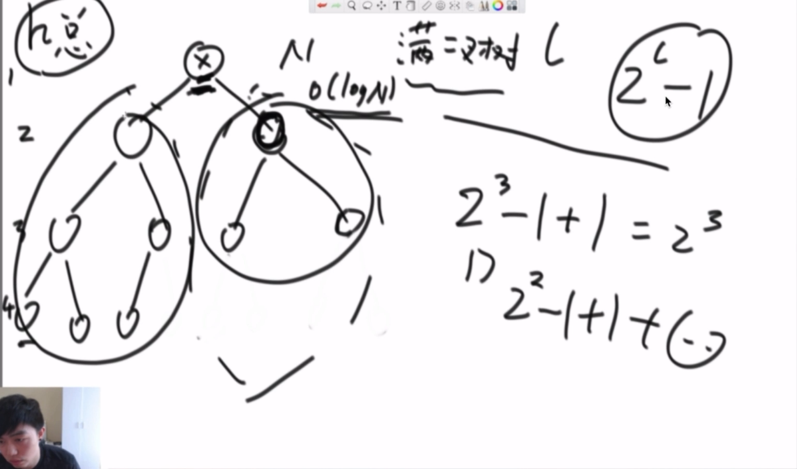

* 判断一颗是不是二叉搜索树(binary search tree)(任何一个节点的左子树都小,右子树都大)
	1. 中序遍历递增的数
	2. 中序遍历非递归版本中,在输出值的地方判断是不是比上一次的值大

* 判断一棵树是不是完全二叉树(complete binary tree)(就是每一层都怼满)
	1. 二叉树按层遍历,如果一个节点有右节点,但是没有左节点,直接返回false
	2. 一个节点只有左节点,或者左右节点都没有,那么该节点后面的节点都要没有左右节点

* 判断一棵树是不是平衡二叉树(balance binary tree)(树中任意一个子树的左右子树高度差不超过1)(树形DP)
	1. 递归函数,参数为当前节点
	1. 定义一个类`ResultData`,属性为是否平衡`isBalance`和高度`height`
	1. 判断节点是否为空,为空返回`new ResultData(true,0)`
	2. 判断当前节点的左节点返回的结果是不是平衡,不是直接返回结果
	3. 判断当前节点的右节点返回的结果是不是平衡,不是直接返回结果
	4. 判断当前节点左右节点返回结果的高度差是否满足,满足则返回左右结果中最大高度+1作为高度	

* 二叉树的序列化和反序列化
	1. 序列化
		先序遍历,用_分割,用#作为空占位符
	2. 反序列化
		1. 先用_将字符串分割成队列
		2. 用递归实现的前序遍历重新构建树

* 按层打印二叉树
	1. 使用队列存每一层从左到右的节点,只要队列不空,就一直打印

* 在二叉树中寻找一个节点的后继节点(也可以想一下前驱节点),所谓后继节点就是中序遍历中的后一个节点
	1. 判断给定节点是否有右子树,有的话后继节点就是右子树的最左节点
	2. 没有右子树的话,判断给定节点是否为其父节点的左节点,是的话父节点就是后继节点;不是的话一直往上找,直到某个节点是其父节点的左节点,该父节点就是后继节点
* 实现二叉树的先序,中序,后序遍历,递归和非递归方式(TreeNode.java)
	* 递归方式就是打印语句放在第一行,中间,还是最后
	* 非递归方式
		1. 先序遍历
			准备一个栈,push head节点,然后循环(弹出最上面的,打印,每次按照先右子节点,后左子节点的顺序压入栈)
		2. 中序遍历
			1. 准备一个栈,如果当前节点不为空或者栈不为空,
				1. 一直压入左节点,
				2. 如果当前节点为空,从栈中弹出节点打印,并将当前节点指向打印节点的右节点
		3. 后序遍历
			1. 准备一个栈1,push head节点,然后循环(弹出最上面的,存入栈2,然后按照先左节点,后右节点入栈)
			2. 最后依次弹出栈2的节点


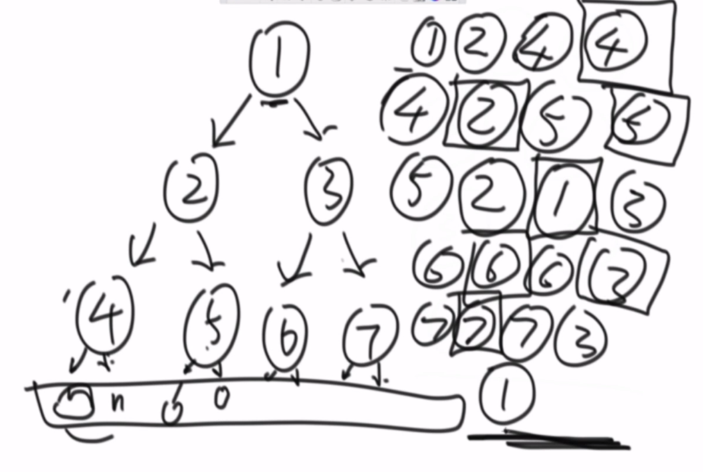


* 反转单向链表

* 之字形打印
	思路:
	1. 指针a往右走,到底之后往下
	2. 指针b往下走,到底之后往右
	3. 按照ab之间的连线打印数字

* 判断链表有没有环,并返回入环节点(IsRingNodeList.java)
	解法一:
	1. 遍历链表,使用Set保存出现过的节点,然后返回重复出现的
	2. 时间N,空间N
	解法二:
	1. 快指针一次两步,慢指针一次一步,在环里相遇后快指针回到headNode,
	2. 快指针,慢指针同时一次走一步前进,相遇的地方就是入环节点
	3. 时间N,空间1

* 判断两条单向链表是否相交,返回第一个相交的节点(IsNodeListIntersect.java)
	* 一条有环,一条无环,不可能相交
	* 两条无环的链表
		1. 遍历两条链表,记录长度和最后一个节点
		2. 判断最后一个节点是否是同一个节点,不是的话不可能相交
		3. 计算长度差,假设是d,长的链表先从头走d步,然后两个一起遍历,第一个相等的节点就是相交
	* 两个都有环
		1. 两个不相交
			* 分别找到入环节点,其中一个入环节点开始遍历,与另一个入环节点比较,要是回到入环节点的时候还没有相等,说明不相交
		2. 拓扑2
			* 入环节点相等,然后以入环节点为终点,相当于找无环链表相交的节点
		3. 拓扑3
			* 入环节点不相等,但是遍历过程中找到另一个入环节点,返回任意一个入环节点

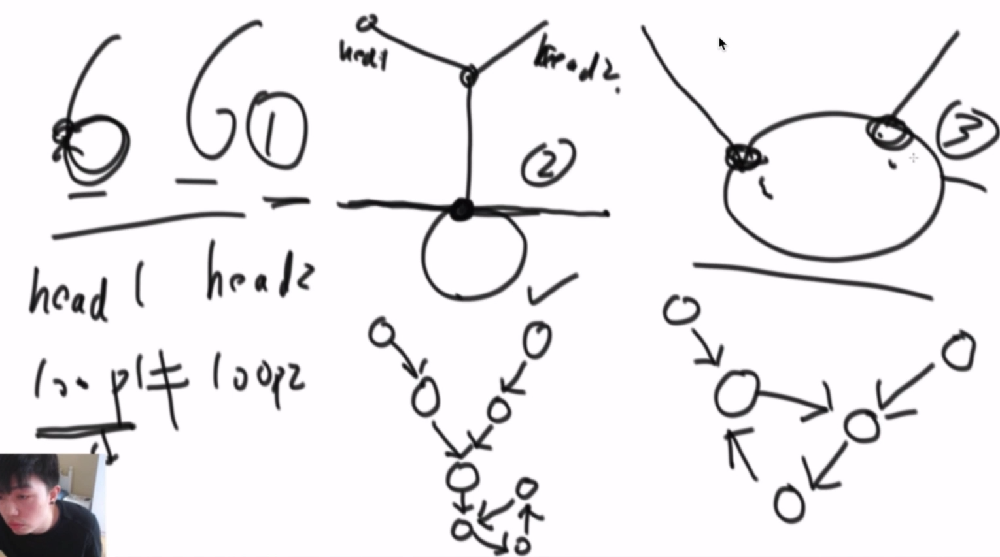 

#### tip
* 计算mid
	* 使用`L+(R-L)/2`比`(L+R)/2`安全,因为不用担心下标越界,也可以写成位运算`L+(R-L)>>1`
	* 为什么:在计算不能整除的负数下标和的时候可能会越界,不过一般用不到

#### 各种排序算法以及优缺点
>参考地址:https://blog.csdn.net/speedme/article/details/23021467

* 递归函数的时间复杂度计算master公式
	* 能够匹配公式:`T(N) = a*T(N/b) + O(N^d)`的都能按照以下式子估算:
		1. loga(b) > d -> O(N^loga(b))
		2. loga(b) = d -> O(N^d * logN)
		3. loga(b) < d -> O(N^d)

* 工程上的综合排序
	1. 普通类型(int,double,short等):快速排序
	2. 自定义的类:归并排序
	3. 长度很小的数组(小于60?):插入排序
		因为常数项小


* 时间复杂度为O(N^2)的三个排序
	* 冒泡排序 bubbleSort (与数据状况无关),可以稳定
	    * 每一趟遍历将最大的或者最小的交换到一边,下一次就遍历就不经过它了,时间复杂度`O(N^2)`,额外空间复杂度`O(1)`
	* 插入排序 insertionSort (和选择排序的区别就在于,当数组有序的时候遍历一次就行了,也就是和数据状况有关,可以稳定)
	    * 从第二个数字开始到最后一个数字,每次将这个数字与之前的数字作比较,大(或者小)就和前面的数字交换,直到不符合条件,时间复杂度最好`O(n)`,最差`O(n^2)`,空间`O(1)`
	* 选择排序 selectionSort(工程上几乎不用,与数据状况无关,不稳定)
	    * 每一次遍历选择最大或者最小的数,和这一次遍历开头的数交换,时间复杂度`O(n^2)`,空间复杂度`O(1)`
	
* 时间复杂度为`O(N*logN)`的三个排序
	* 归并排序 mergeSort (可以稳定)
	    * 递归,将数组分成两部分,分别排好序然后在合并(通过外排),时间复杂度`O(N*logN)`,额外空间复杂度`O(n)`
	    * 算法步骤:
		    1. 归并主函数:`void mergeSort(int[] arr)`,调用`mergeProcessor(arr,0,arr.length-1)`
		    2. 递归调用函数:`void mergeProcessor(int[] arr,int L, int R)`,当`L==R`的时候返回,计算`mid`,调用`mergeProcessor(arr, L, mid),mergeProcesser(arr, mid + 1, R)`,调用`merge(arr, L, mid, R)`,
		    3. 合并函数:`void merge(int[] arr, int L, int mid, int R)`,新建`int helper[R-L+1]`(可以生成一个全局的,就不用一直生成销毁),将两部分数组按顺序填入
	* 快速排序 quickSort (不稳定)
	    * 快速排序的主要思想是,在数组中随机找到一个数字作为基数,然后将大于这个数的放到它一边,小于它的数放在另外一边,然后左右再次进行相同的操作,直到排序完成.因为等于基数的元素也会被移动位置,所以快排是不稳定的.
	    * 经典快排的缺点:总是拿最后一个数去作为pivot,这样就会和数据状况很有关,最坏的情况就是有序数列排序的话时间复杂度就是O(N^2)
	    	* 时间复杂度`O(N*logN)`,额外空间复杂度`O(logN)`
	* 堆排序 heepSort (堆就是完全二叉树,不稳定)
		* 满二叉树:就是最后一层的叶节点全部补齐(是特殊的完全二叉树)
		* 完全二叉树:如果最后一层没有全部补齐,那么需要从左到右依次补齐.
		* 数组转换成完全二叉树:
			* 当前节点的叶节点:左:`2*i+1`,右:`2*i+2`,越界则说明没有
			* 当前节点的父节点:`(i-1)/2`
		* 大根堆:每一棵子树的最大值都是这课子树的头部
		* 将一个数组排成大根堆(heapInsert)的时间复杂度:`O(N) = log1 + log2 + log3 + ... + log(N-1)`
		* heapIfY:如果大根堆中有一个数字变小了,将对重新调整成大根堆
* 有关排序问题的补充:
	1. 归并排序的额外空间复杂度可以变成O(1),但是很难,"归并排序 内部缓存法"
	2. 快排可以做到稳定,但是很难,"01 stable sort"
	3. 题目:一个数组,奇数放左边,偶数放右边,要求原始相对次序不变,时间复杂度O(N),额外空间复杂度O(1)

* 比较器:继承`Comparator<Student>`接口,实现`compare(Student s1,Student s2)`方法
	* 返回负数:第一个参数放前面
	* 返回正数:第一个参数放后面
	* 返回0:相等

* 系统提供的堆
	1. PriorityQueue(实质上是一个堆结构),构造的时候传入比较器

* 非基于比较的排序
	1. 桶排序
		2. 计数排序
		3. 基数排序


#### 常见算法题

* 小和问题 (LittleSum.java)
	1. 在一个数组中,每一个数左边比这个数小的数累加起来,叫做这个数组的小和,求一个数组的小和.
	2. 思路:这个过程就相当于找每一个数右边有几个数比当前数大,然后将当前数x上个数,然后累加,这个过程可以在**归并排序**的过程中进行计算
	在merge的过程中,在左边数组和右边数组比较的同时计算小和,只要将左边数组比右边小的数字直接乘上右边数组中比他大的数字的个数
	3. 为什么能够加速:因为每次左右数组比较的时候,当左边的数字比右边小的时候,就可以根据右边数组的下标直接得到右边数组有几个比左边数组这个数大

* 逆序对问题 
	1. 类似于小和问题,在归并的过程中直接就可以将逆序对输出

* 荷兰国旗问题(HollandNationFlag.java)
	1. 给定一个数组arr,一个数num,将小于,等于,大于num的数字放在左中右,要求额外空间复杂度O(1)(意思就是不用辅助数组),时间复杂度O(N)(遍历数组的次数固定)
	2. 思路:就是快排的partition函数改一下,smaller从左往右,bigger从右往左,因为还有一个==要比较,相当于小于区域推着等于区域往前走,这个修改后的partition函数可以用来优化之前的快快排
	
* 找中位数
	1. 有一个流一直在输出数,可以用一个数组接受,然后随时取得数组的中位数
	2. 思路:用一个大根堆和一个小根堆,大根堆存放较小的一半数字,小根底存放较大的一半数字,每次接收数字后放到数字较少的数组,然后调整堆,那么堆顶的数字有一个是中位数.

* 找最大差值(MaxGap.java)
    1. 给定一个数组,求排序之后的相邻两个数字之间的差值的最大值,要求时间复杂度O(N):
	2. 思路:由于时间复杂度要求,所以不能用普通的排序,可以使用桶排序
		1. 按照数组中最大值和最小值的差值确定每个桶的存放数字范围,最大值放在len位置,最小值放在0位置,所以桶的数量为len+1,必有一个空桶
		2. `index = (int)((num - min) * len / (max - min))`确定一个数应该放在哪里
		2. 每个同种只存放这个桶的最大值最小值以及同种是否有数,
		3. 遍历桶,求当前桶的最小值和上一个非空桶的最大值的差值,(前提是有非空桶,不然每个桶中最大最小的差值也要加入比较)
		
* 两个队列实现栈(StackByQueue.java)
	1. data队列和help队列
	2. 需要pop的时候先将data队列除了最后一个数的其他数字poll到help队列中,返回data中最后一个数
	3. 交换data和help的引用

* 两个栈实现队列(QueueByStack.java)
	1. push栈和pop栈
	2. 只要pop栈中有元素,就不能从push栈中倒元素到pop
	3. 倒元素要一次全部倒完

* 判断回文链表(IsPalindrome.java),比如1221,12321

	解法一:
	1. 将链表依次弹入栈,然后遍历链表同时依次弹出栈,比较,时间复杂度O(N),额外空间O(N)
	
	解法二:
	1. 定义两个指针,一个快指针,一个慢指针,通过他们找到链表中点,记住中点和最后一个节点
	2. 将中点指向null,中点之后的节点逆序
	3. 然后比较两侧的节点,最后要还原节点指向
	4. 时间复杂度O(N),额外空间复杂度O(1)

* 回旋打印数组
	思路:先确定左上角和右下角,然后打印边框,分成4个边打印,然后缩小左上角和右下角

* 给定一个链表和一个数字num,将链表中大于num的放右边,等于num的放中间,小于num的放左边(PartitionNodeList.java)
	解法一:
	1. 将链表的节点放在数组中,写一个partition函数排好,再串成链表
	2. 时间复杂度O(N),额外空间O(N)
	解法二:
	1. 准备三个节点,less,equal,more
	2. 遍历链表,将less指向第一个小于num的,equal指向第一个指向num的,more指向第一个大于num的
	3. 时间复杂度O(N),额外空间O(1)
	3. 再次遍历链表,相应的节点分配到三个部分

* 拷贝链表(CopyRandomNodeList.java)
	链表的每一个节点除了包含nextNode指针信息,还有一个randomNode指针,实现一个方法,返回拷贝出来的链表的头指针
	解法一:
	1. 使用一个Map<Node, Node>保存原节点,复制节点的信息,然后通过遍历原链表,来确定复制节点的nextNode和randomNode应该指向哪里
	2. 时间N,空间N
	解法二:
	1. 将原链表的每一个节点的指向它的复制节点,复制节点指向原来的下一个节点
	2. 复制节点的random指针指向的就是原节点的random指针指向节点的下一个节点
	3. 分离链表


