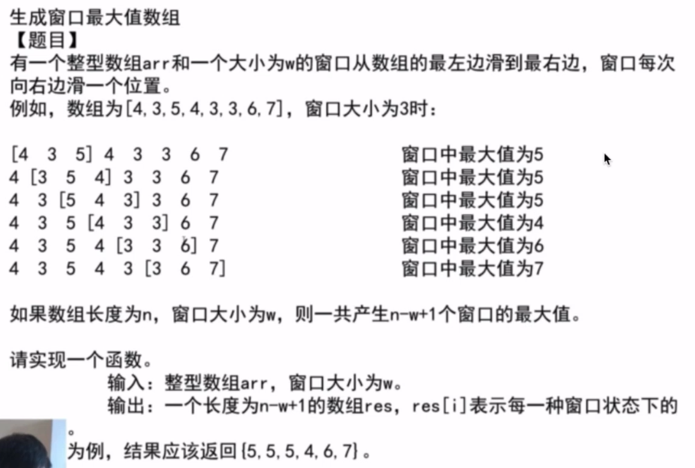
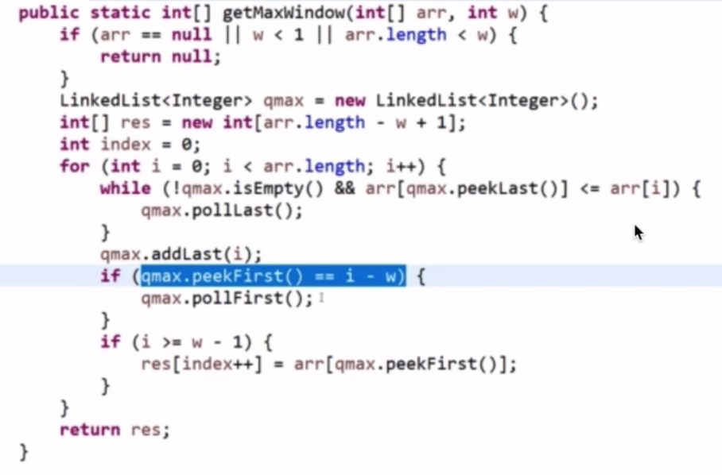
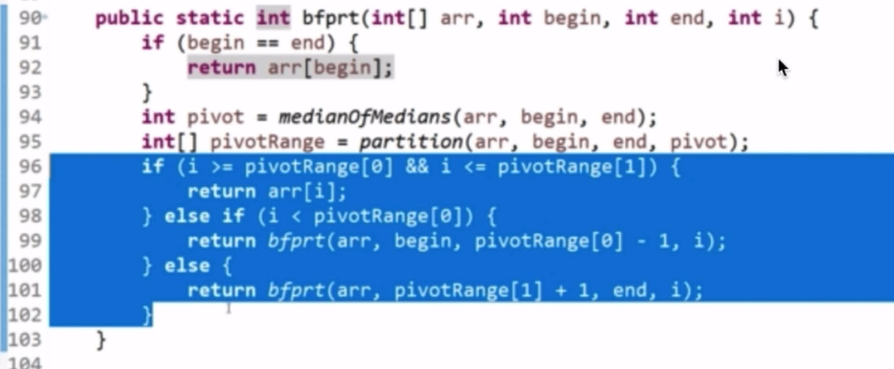
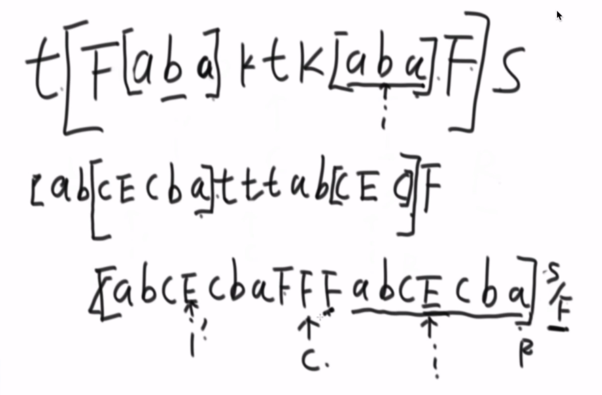

### 算法笔记
======

#### 经典算法
======

* 窗口结构的应用
	1. 求一个数组子数组的最大最小差值小于等于num的个数
		1. 一个子数组如果满足条件,那么这个子数组的所有子数组满足条件
		2. 一个子数组如果不满足条件,那么包含这个子数组的数组一定不满足条件

* 窗口结构
	1. 窗口滑过数组,返回每次窗口中的最大值
		1. 准备一个双端队列,
		2. 往队列尾部加元素下标,当前加的元素要是大于等于之前的元素,之前的元素的下标弹出
		3. 窗口形成之后随着左边界移动从队列中移除对应下标,队列头为当前窗口最大值

* BFPRT算法
	1. 在一个无序数组中找到第k大的数字,时间复杂度O(n)
		1. 将数组分成五个数一组(余数一组),每组取中位数,组成的数组在分组取中位数直到最后返回一个数(O(1)+O(N)+O(N)+T(N/5))
			1. 假设一次分组取中位数的过程为T(N),则第二次为T(N/5)
		2. 根据这个数字将数组分成左中右,判断k在不在中间(O(N))
		3. 根据判断选择左边或者右边继续以上步骤(T(7N/10))
		4. 时间复杂度为:T(N) = T(N/5)+T(7N/10)+O(N)
	

* KMP
    * 用来求解一个大字符串str1中是否包含小字符串str2
        1. next数组:每一个字符之前的最大相等前缀和后缀长度
        2. 通过next数组加速
        
* 有一个原始串abcabc,在它的后面加上自己的子串,是的得到的新字符串中包含两个原始串,且开头位置不一样,求最短的那个加法
    1. 求原始串的next数组
    2. 根据next数组求解
* 求一棵树是否是另一棵树的子树
    1. 将两棵树序列化,然后用KMP算法计算
    
* Manacher算法
    * 求解一个字符串中的最大回文子串长度
        1. 为了偶回文和奇回文都能用,要加#
        1. 回文半径数组
        2. 最右回文右边界R,此时的中心为C
    * 可能性
        1. 当前字符不在回文右边界R里,暴力破解
        2. 当前字符在回文右边界R内
            1. 当前字符位置i关于C的对称点i'的回文半径在L内,那么i的回文半径等于i'的回文半径
            2. 要是回文半径在L外头,那么i的回文半径就是R
            3. 要是回文半径在L上,i的回文半径需要尝试

* manacher应用,在一个字符串后面添加字符,让它变成回文,求最短
    1. 就是求每一个字符的回文半径,当有一个字符的回文半径R达到最右边的时候,此时的L到开头位置就是要加的字符

